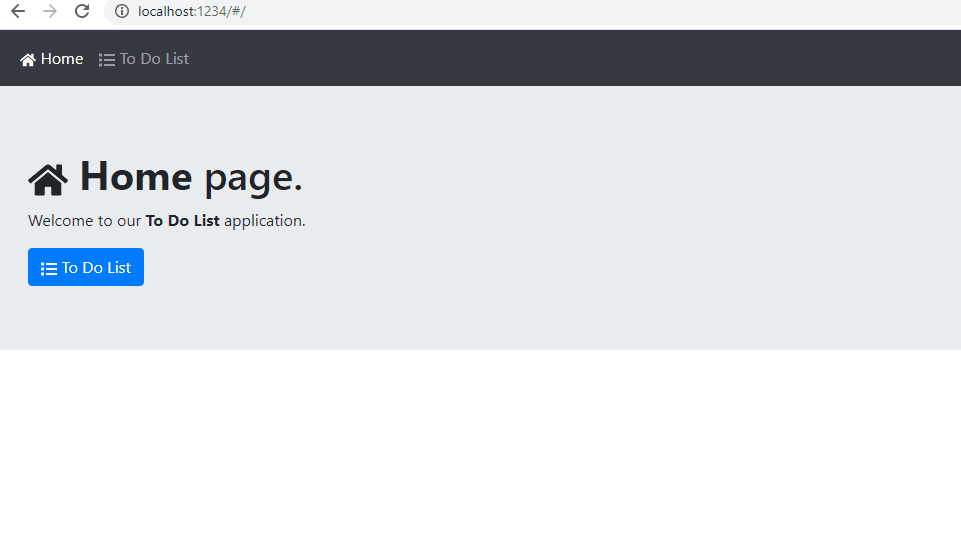
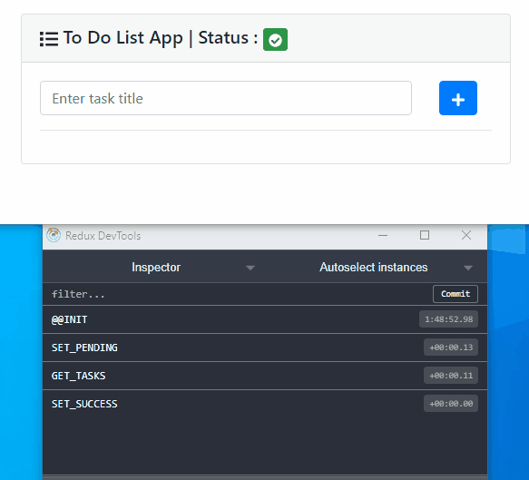

# React.js Demonstration - *To Do List*

***A series of tutorials to understand React.js by implementing a complete To Do List Application.***

---

## Table of Contents

- [Coding Environment](#coding-environment)
- [Coding Steps](#coding-steps)
  1. [Basic App](#basic-app)
  2. [Navigation](#navigation)
  3. [Data Management](#data-management)
  4. [REST API Integration](#rest-api-integration)
- [License](#license)

---

## Coding Environment

This projet is built using these technologies:

- Programming Language: **JavaScript**
- Web Browser: **Google Chrome**
- Code Editor: **Microsoft Visual Studio Code** *(with extensions)*
- Other software: **Node.js**
- Project Management Tool: **Nano React App** *(lightweight alternative to **Create React App**)*

## Coding Steps

### Basic App

#### 1. Requirements 

In this step, we need the following libraries which will be installed with `npm` or `yarn`: 

- Bootstrap (CSS Framework): `npm install bootstrap react-bootstrap`
- React Icons: `npm install react-icons`
- UUID (Unique ID Generation): `npm install uuid`

> **Important** : *it is possible to make installation through one command:* `npm install bootstrap react-bootstrap react-icons uuid`

In order to debug the application, it is recommanded to use the web browser extension **React Developer Tools** (*available for* **Google Chrome**, **Mozilla Firefox** and **Microsoft Edge**).

#### 2. Goals

In this steps, we have to achieve the following goals: 

1. Create the *user interface* with components
1. Add data transfer between components
1. Implement the different actions

#### 3. Result

Below a demonstration:

### Navigation

#### 1. Requirements 

In this step, we need the following libraries which will be installed with `npm` or `yarn`: 

- React Router: `npm install react-router-dom`

#### 2. Goals

In this steps, we have to achieve the following goals: 

1. Create two different routes: 
    * The **home** *page*
    * The **to do list** *page*
1. Handle errors in routes URL
1. Add a navigation bar

#### 3. Result

Below a demonstration:

### Data Management

#### 1. Requirements 

In this step, we need the following libraries which will be installed with `npm` or `yarn`: 

- Redux (with its react integration): `npm install redux react-redux`

In order to debug the application, it is recommanded to use the web browser extension **Redux DevTools** (*available for* **Google Chrome**, **Mozilla Firefox** and **Microsoft Edge**).

#### 2. Goals

In this steps, we have to achieve the following goals: 

1. Configure *Redux* and *Redux DevTools*
1. Create and configure the *store*
1. Add *action creators* and *reducers*
1. Connect the components to the store and action creators

#### 3. Result

The apparent result is the same as previous with an optimized data management with Redux. 

### REST API Integration

#### 1. Requirements 

In this step, we need the following libraries which will be installed with `npm` or `yarn`: 

- Redux Thunk (middleware): `npm install redux-thunk`
- Axios (http client): `npm install axios`

The **REST API** is available in : `https://yyacine.pythonanywhere.com/tasks/<user_key>`. 

The `<user_key>` is required to have access to the **REST API**.

#### 2. REST API Guide

| URL | Method | Data | Description |
| --- | --- | --- | --- |
| `/tasks` | **GET** | None | *Return all the tasks* |
| `/tasks/<task_id>` | **GET** | None | *Return task with specific ID* |
| `/tasks/<task_id>` | **DELETE** | None | *Remove task with specific ID* |
| `/tasks/<task_id>` | **PATCH** | One or several data | *Update task with specific ID* |
| `/tasks` | **POST** | `{ title: (string), code: (string), status: (boolean) }` | *Add a new task* |

#### 3. Goals

In this steps, we have to achieve the following goals: 

1. Add *Redux Thunk* to the *store*
1. Modify the action creators to support *asynchronous http* requests
1. Use the *Hooks* `useEffect()` and `useState()`

#### 4. Result

Below a demonstration:

## License

