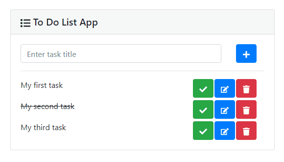

# React.js Demonstration - *To Do List*

***A series of tutorials to understand React.js by implementing a complete To Do List Application.***

---

## Table of Contents

- [Coding Environment](#coding-environment)
- [Coding Steps](#coding-steps)
  1. [Basic App](#basic-app)
  2. [Navigation](#navigation)
  3. [Data Management](#data-management)
  4. [REST API Integration](#rest-api-integration)
- [License](#license)

---

## Coding Environment

This projet is built using these technologies:

- Programming Language: **JavaScript**
- Web Browser: **Google Chrome**
- Code Editor: **Microsoft Visual Studio Code** *(with extensions)*
- Other software: **Node.js**
- Project Management Tool: **Nano React App** *(lightweight alternative to **Create React App**)*

## Coding Steps

### Basic App

#### 1. Requirements 

In this step, we need the following libraries which will be installed with `npm` or `yarn`: 

- Bootstrap (CSS Framework): `npm install bootstrap react-bootstrap`
- React Icons: `npm install react-icons`
- UUID (Unique ID Generation) : `npm install uuid`

> **Important** : *it is possible to make installation through one command:* `npm install bootstrap react-bootstrap react-icons uuid`

In order to debug the application, it is recommanded to use the web browser extension **React Developer Tools** (*available for* **Google Chrome**, **Mozilla Firefox** and **Microsoft Edge**).

#### 2. Goals

In this steps, we have to achieve the following goals: 

1. Create the *user interface* with components
2. Add data transfer between components
3. Implement the different actions

#### 3. Result

Below a demonstration:

### Navigation

*TBD*

### Data Management

*TBD*

### REST API Integration

*TBD*

## License

